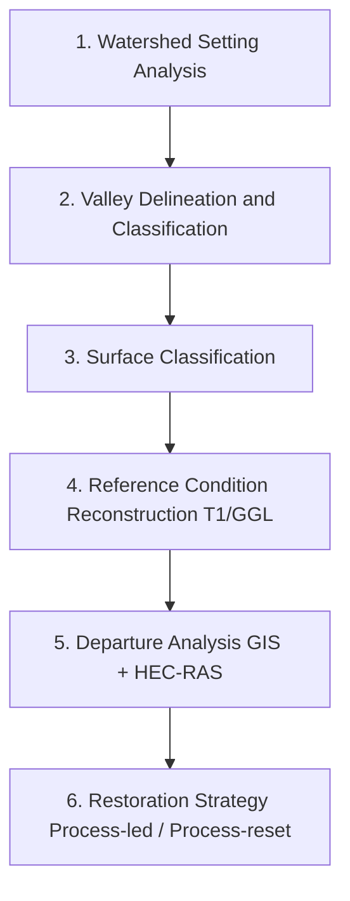

# A Guide to Geomorphic Departure Analysis with GIS

**Applying the Geomorphic Grade Line and Relative Elevation Models to Inform Process-Based Restoration Strategies**

*Lower Middle Fork Teanaway River — Valley Bottom Reset*

---

This guide presents a multi-stage geomorphic assessment workflow to inform process-based river restoration. The methodology uses LiDAR-derived Digital Elevation Models, hydraulic geometry relationships, and GIS-based analysis to reconstruct the pre-disturbance Holocene fluvial process space (the T1 reference condition) and quantify departure from that condition under contemporary conditions.

The framework is grounded in the Stream Evolution Model and Stream Evolution Triangle (Cluer & Thorne 2013, Castro & Thorne 2019), with particular emphasis on the Stage 0 river-wetland corridor as the ecologically optimal pre-disturbance condition.

## Document Structure

| Section | Title | Description |
|---------|-------|-------------|
| 1 | [Overview](sections/01-overview.md) | Important terms, restoration philosophy, generalized workflow |
| 2 | [Watershed Setting](sections/02-watershed-setting.md) | Geomorphic setting, hydrologic regime, ecological context, historical disturbance |
| 3 | [Valley Floor Approximation (Qvf)](sections/03-valley-floor-approximation.md) | Hydrography preparation, IDW-REM generation, valley floor delineation, transect construction |
| 4 | [Transect Minimum Elevation Spline Fit](sections/04-transect-minimum-elevation-spline-fit.md) | Jupyter Notebook workflow for fitting univariate splines to transect minimum elevations |
| 5 | [Classify Valley Floor Surfaces](sections/05-classify-valley-floor-surfaces.md) | Natural Breaks classification of fit-REM values for surface type/origin |
| 6 | [Geomorphic Grade Line Spline Fit](sections/06-geomorphic-grade-line-spline-fit.md) | Python workflow for GGL spline fitting to T1-classified surfaces |
| 7 | [Build GGL Surface](sections/07-build-ggl-surface.md) | Conditional filling, design surface polygons, cut/fill volumes |
| 8 | [GGL Design Surface](sections/08-ggl-design-surface.md) | Cut/fill volumes, ramping at project boundaries, GGL texturing |
| 9 | [Appendix](sections/09-appendix.md) | Tutorial data inventory, Jupyter notebook resources, ArcGIS Pro tips |

## Key Concepts

| Term | Definition |
|------|------------|
| **Stage 0 (SEM)** | Pre-disturbance, natural condition of a stream system characterized by multi-threaded channels, wetlands, and high connectivity across the valley floor (maximum fluvial process space). The alluvial aquifer is at or near the GGL throughout the water year. |
| **Geomorphic Grade Line (GGL)** | The slope profile of the Holocene fluvial process space at Stage 0, or the slope profile of the maximumly connected (vertical and lateral) geomorphic surfaces. |
| **Relative Elevation Model (REM)** | Raster dataset showing elevation values relative to a dynamic baseline (water surface, thalweg, or geomorphic grade line). |
| **T1 Surface** | The pre-disturbance, pre-Anthropocene valley floor surface representing the reference condition fluvial process domain. |
| **Departure Analysis** | Quantification of geomorphic and habitat departure between contemporary conditions and the reconstructed T1 reference condition using GIS analysis and comparative hydraulic modeling. |
| **Process-Based Restoration** | Restoration following Beechie et al. (2010) principles: address root causes of degradation, work within site potential, scale actions to magnitude of degradation, be explicit about expected outcomes. |

## Generalized Workflow

## Source Document

This site is a markdown rendering of the USDA Forest Service guidance document:

> *A Guide to Geomorphic Departure Analysis using Relative Elevation Models in ArcGIS Pro (Lower Middle Fork Teanaway River)*
> USDA Forest Service — Washington Office, Enterprise Program, Restoration Services
> Aquatic Restoration Team

The original document is intended as a living document, expected to evolve as collective understanding and methods for analysis improve.

## How to Navigate

Use the sidebar (left) to jump between sections, or the table of contents (right) to navigate within a section. The search bar at the top right indexes all content for keyword lookup.
