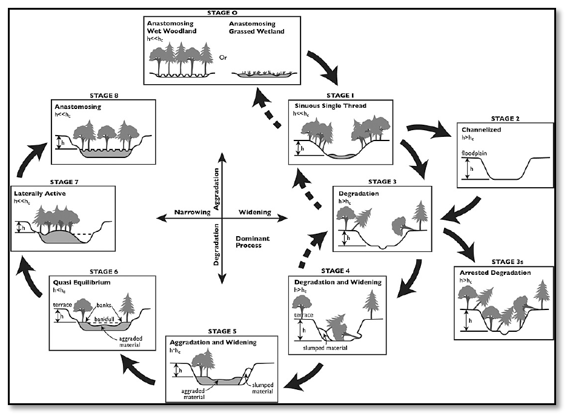
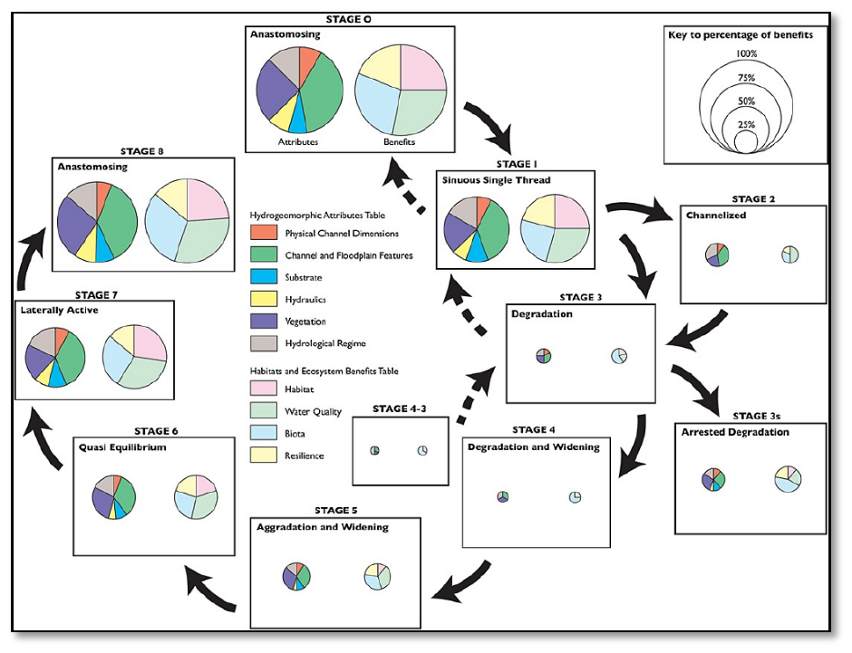
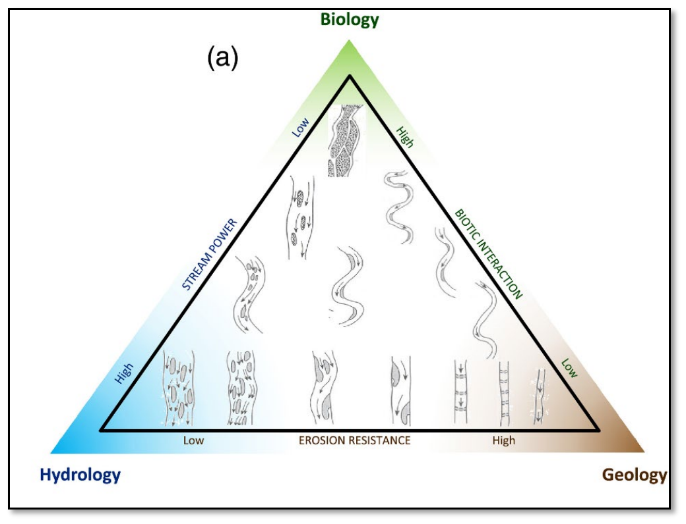
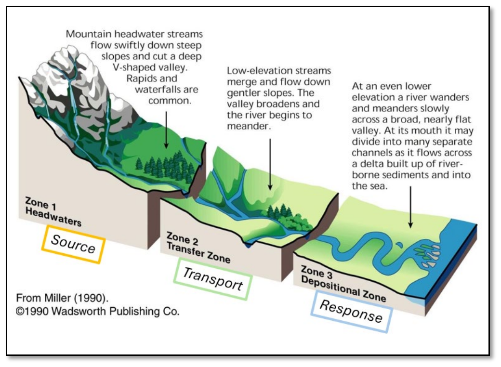
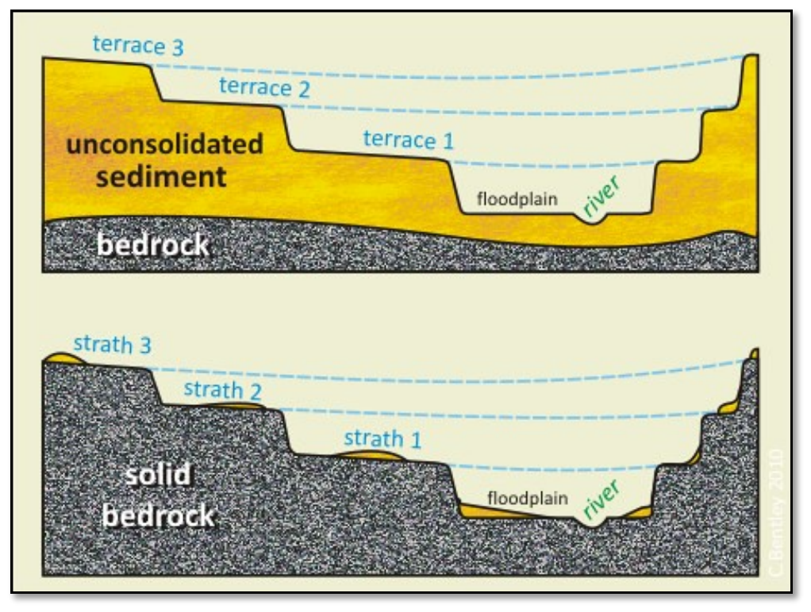
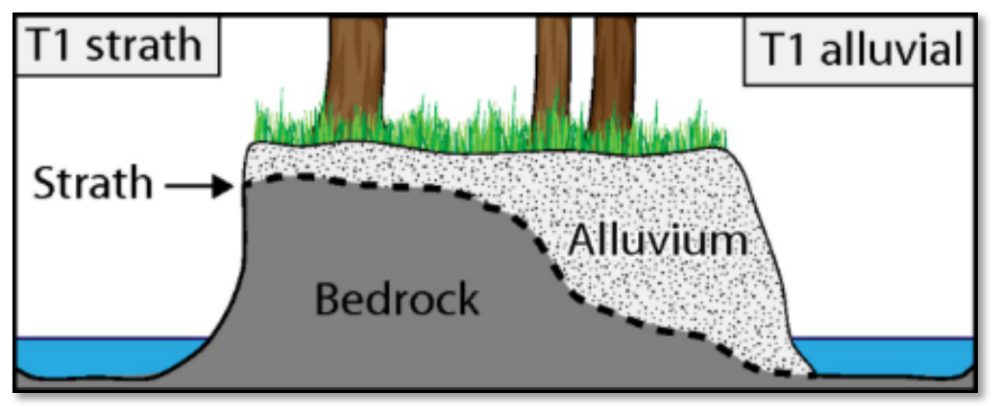

# 1 Overview

This guide is presented as a living document, intended to evolve as our collective understanding and methods for analysis improve. It suggests a multi-stage geomorphic assessment to inform process-based river restoration. To establish a common starting point, the guide first defines some key terminology we believe is important to frame our understanding and then outlines a set of guiding assumptions. There are many additional supporting strategies that are not mentioned, this guide is far from comprehensive.

With this shared context in place, the guide promotes a generalized workflow that moves from broad analysis to specific restoration strategy development. This guide provides detailed GIS instruction specifically on a central component: the reconstruction of the pre-disturbance Holocene fluvial process space reference condition (T1). This step utilizes Geomorphic Grade Line (GGL) and Relative Elevation Model (REM) analysis to establish a plausible historical baseline surface, which then facilitates a thorough departure analysis when combined with other supporting analysis, such as hydraulic modeling with HEC-RAS. A complete assessment should culminate in the development of an appropriate restoration strategy. This strategy (restore, rehabilitate, or reimagine) must be informed by the departure from historic conditions but ultimately scaled to the site's future recovery potential, considering factors like persistent constraints such as dams, ongoing land management, and climate change.

The complexity and depth of each assessment should be tailored to the specific site and stakeholder interests. The relative importance of each section is expected to be highly variable with some sections requiring detailed modeling and field validation, while others simply catalog important context and help refine questions. The overarching goal is to begin with a broad analysis to ensure that significant local processes are identified.

!!! note
    “Geomorphology is not a linear, cause-and-effect science. Inherent complexities and uncertainties prompt perceptions of the process of interpretation in geomorphology as a frustrating form of witchcraft or wizardry — a dark art. Alternatively, acknowledging such challenges recognizes the fun to be had in puzzle-solving encounters that apply abductive reasoning to make sense of physical landscapes, seeking to generate knowledge with a reliable evidence base. Carefully crafted approaches to interpretation relate generalized understandings derived from analysis of remotely sensed data with field observations/measurements and local knowledge to support appropriately contextualized place-based applications.” Brierly et al 2021

## 1.1 Important Terms

This section defines some important terms as they apply specifically to this guidance. Users should reference these definitions rather than external sources, as terminology varies across publications and authors. Different authors may use alternative terms; therefore, users must exercise judgment in making appropriate distinctions. Stream Evolution Model (SEM) at Stage 0 – represents the pre-disturbance, natural condition of a stream system—characterized by multi-threaded channels, wetlands, and high connectivity across the valley floor (maximum fluvial process space). Characteristic of Stage 0 valleys is an alluvial aquifer at or near the GGL throughout the water year.

<small>**Figure 1**: Cluer & Thorne (2013)</small>

<small>**Figure 2**: Cluer & Thorne (2013)</small>

Stream Evolution Triangle (SET) – The stream evolution triangle illustrates the balance among geology (erosion resistance), hydrology (stream power), and biology (biotic interaction). It serves as a conceptual framework for identifying process domains and anticipating fluvial geomorphic responses across sites and through time, whether driven by natural stream evolution or by changes to these primary drivers.

<small>**Figure 3**: Castro and Thorne (2019)</small>

Geomorphic Grade Line (GGL) – represents the slope profile of the Holocene fluvial process space at Stage 0, or more generally the slope profile of the maximumly connected (vertical and lateral) geomorphic surfaces.

Relative Elevation Model – a raster dataset that shows elevation values relative to some dynamic baseline (e.g., water surface for a given flow, bathymetric thalweg, or geomorphic grade line).

Valley Confinement – can be described in several ways, and each method has its own limitations—for example, using the ratio of channel width to valley floor width, the length of channel margins abutting hillslopes, or some stream power threshold. Montgomery and Buffington (1997) define valley confinement based on the ratio of valley floor width to active channel width. Valley floors are considered the areas between valley walls that would be inundated during a flood with a 50 to 100-year recurrence interval, or the areas that could potentially be occupied by the channel and its floodplain.

**Source, Transport, and Response Reaches**

<small>**Figure 4**.</small>

Quasi-Equilibrium vs Meta-stability — Quasi-equilibrium systems continuously self-adjust, while metastable systems resist change until overwhelmed, then undergo rapid transformation to entirely different configurations (patchiness). We typically think about these concepts at the reach-scale geomorphic units (pools, jams, gravel bars, etc.) for a given stream evolution stage (i.e. resilience maintaining stage zero).

Terrace vs. Strath – A terrace is comprised of thick alluvial deposits from distinct geologic events, whereas a strath is a bedrock surface with a thin layer of alluvium on top.

<small>**Figure 5**: *NEED SOURCE</small>

<small>**Figure 6**: SCHANZ</small>

Armored alluvium – Exposed underlying valley fill comprised of coarse, often cemented, materials (gravel, cobbles, boulders, etc.) that are unable to be reworked by contemporary fluvial processes, thereby functioning similarly as a bedrock strath. It can also develop within incised channels where increased stream energy from floods deposit larger sediments on top of smaller particles, or when smaller particles are winnowed away leaving larger immobile substrates.

Restore vs Rehabilitate vs Reimagine – “Restore” aims to return the river system to a known historical reference condition; “Rehabilitate” aims for pragmatic betterments under existing constraints; “Reimagine” aims to maximize recovery potential for future resilience.

**Process-led vs Process-reset -**

Misfit Streams – A condition where the stream appears too small given the size of the valley floor (underfit stream).

## 1.2 Restoration Philosophy and Assumptions

- We advocate for river valleys first and we try to avoid shortcuts.
- Restoration actions follow process-based principles (Beechie et al. 2010):
    - Address root causes of degradation
    - Work within the physical and biological potential of the site
    - Scale actions to the magnitude of degradation
    - Be explicit about expected outcomes
- This geomorphic assessment framework aims to help describe and quantify the physical and biological potential of the valley and magnitude of degradation (departure).
- The ecologically optimal condition reflects the pre-disturbance Holocene valley and fluvial process space (T1) represented by a dynamic, river-wetland corridor in quasi-equilibrium. This state maximizes the longitudinal, lateral, and vertical hydrologic connectivity, supporting resilient and self-sustaining floodplain ecosystems.
- River-wetland corridors are highly variable across systems and process domains and need to be locally contextualized.
- Cluer & Thorne’s (2013) Stream Evolution Model (SEM) provides conceptual representation of the potential pre-disturbance valley floor expression (T1 at Stage 0) and associated ecological richness that helps expand our understanding and imagination of the intrinsic potential and magnitude of degradation (departure).
- The current condition is likely degraded due to spatiotemporal anthropogenic disturbances, including direct impacts (valley modification, vegetation clearing, animal displacement) and indirect impacts (altered runoff patterns, sediment loading, changed fire frequency and intensity), as well as cumulative climate change effects on watershed-scale geological, hydrological, and ecological processes.
- The Geomorphic Grade Line and associated Relative Elevation model should be fit to the valley surfaces that most plausibly reflect fluvial process space of the pre-disturbance river-wetland corridor, not necessarily the current condition. This process is iterative, where each GGL-REM, and the associated analysis, helps contextualize surfaces and increase confidence in the fit to the T1 surface.
- The geomorphic assessment and departure analysis should inform potential restoration outcomes and associated treatments and be based in plausible process-based recovery trajectories. No specific treatment is prescribed (valley bottom reset, BDAs, LWD, etc.) until the analysis can justify it.
- Explicit restoration outcomes are defined by measurable trajectories of recovery, which are grounded in the re-establishment and sustained maintenance of formative processes, particularly the recovery of vegetation essential for supporting geomorphic functions.

## 1.3 Generalized Workflow

Moving from broad-scale context to site-specific restoration strategies.

### 1.3.1 Watershed Setting Analysis

Characterize the foundational context of the watershed by describing its primary attributes.

- Geomorphic setting
- Hydrologic regime
- Ecological context
- Historical context and disturbance

### 1.3.2 Valley Delineation and Classification

Delineate the spatial extent of the valley floor (Qvf) using available data such as LiDAR DEMs, geologic maps, and field surveys.

### 1.3.3 Surface Classification

Within the delineated valley floor, classify and map distinct surficial geomorphic units and surface types.

- Alluvial surfaces (fans, deltas, terraces)
- Colluvial deposits
- Glacial deposits
- Bedrock exposures
- Ecological features (wetlands, beaver dams, LWD)
- Anthropogenic features (roads, railroads, infrastructure)

### 1.3.4 Reference Condition Reconstruction

Isolate the pre-settlement valley floor surface (T1) and construct its Geomorphic Grade Line (GGL). Derive a Relative Elevation Model (REM) from the GGL to quantify the vertical departure between the contemporary channel and the reference surface elevation.

### 1.3.5 Departure Analysis

Quantify the geomorphic and habitat departure between existing conditions and the reconstructed T1 reference condition using GIS analysis and comparative hydraulic modeling.

!!! note
    GIS-based metrics :

- Vertical incision
- Profile departure
- Surface type area and volume

!!! note
    Hydraulic Modeling Metrics :

- Inundation extent, depth, and frequency
- Flow velocity, stream power, and shear stress distributions
- Floodplain storage capacity

!!! note
    Habitat metrics :

- Wetted area and hydroperiod
- Habitat indices
- Riparian vegetation potential

### 1.3.6 Restoration Strategy Development

Based on the departure analysis, identify process-based restoration actions and estimate potential recovery trajectories .

Identify and scale potential actions (e.g., process-led to process-reset approaches), prioritizing treatments that maximize hydrologic connectivity to the T1 surface.

Estimate recovery trajectories for key indicators:

- Geomorphic adjustment timescales
- Vegetation establishment
- Habitat-forming flow effectiveness
- Species recolonization potential
- Stakeholder objectives and constraints
