# 4 Transect Minimum Elevation Spline Fit

Objective : Use Jupyter Notebooks to explore transect station elevation data and fit a univariate spline to the transect minimum elevations.

Purpose : Modeled fit values will be joined back to the transect stations feature class and used to construct a Relative Elevation Model (REM) from a TIN. REM values can then be used to help identify and infer grouping of geomorphic surfaces by their relative elevation.

!!! note
    Note: A computational notebook is a shareable document that combines computer code, plain language descriptions, data, rich visualizations like 3D models, charts, graphs and figures, and interactive controls. A notebook, along with an editor like Jupyter Notebook, provides a fast interactive environment for prototyping and explaining code, exploring and visualizing data, and sharing ideas with others.- https://jupyter-notebook.readthedocs.io/en/latest/

**Data Needs:**

- GIS Point Feature Class - Transect Stations with elevation values
- Custom Python Functions Script – PythonFuncs_Ver2.0_02DEC2025.py
- Jupyter Notebook - Qvf_Min_Ver1.0.ipynb

The notebooks provided are comprised of two cell types: Markdown and Python .

- Markdown cells are used for documentation, explanations, and guidance . They allow you to add headings, formatted text, lists, and equations to describe your workflow.
- Python Code cells are used for running code, data analysis, and visualization . They execute commands directly in the notebook environment.

**You can tell the cells apart by their appearance in the notebook interface :**

- Markdown cells display formatted text once run.

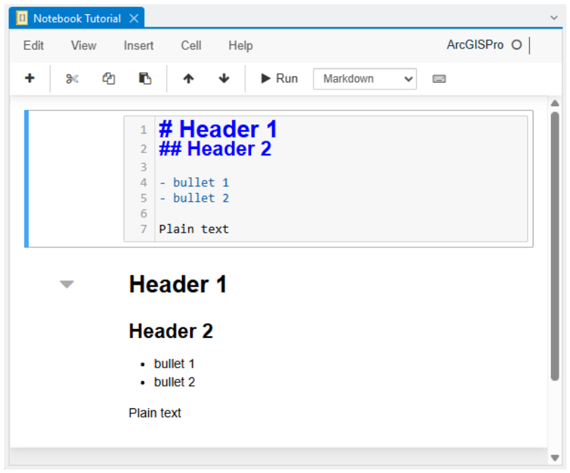

- Code cells show syntax-highlighted Python code and produce outputs (tables, plots, or printed results) beneath them.

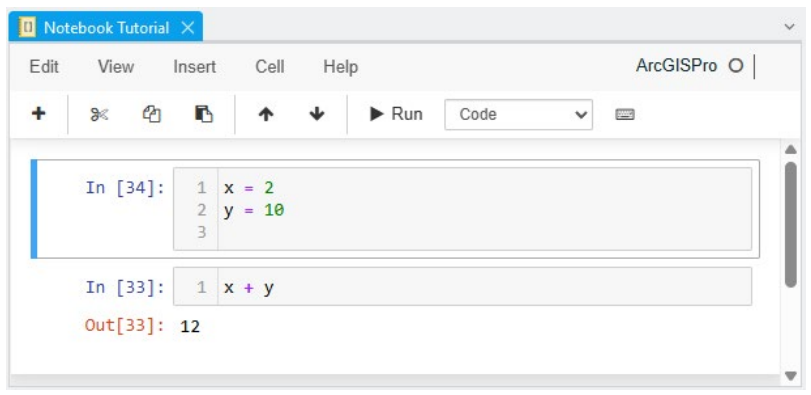

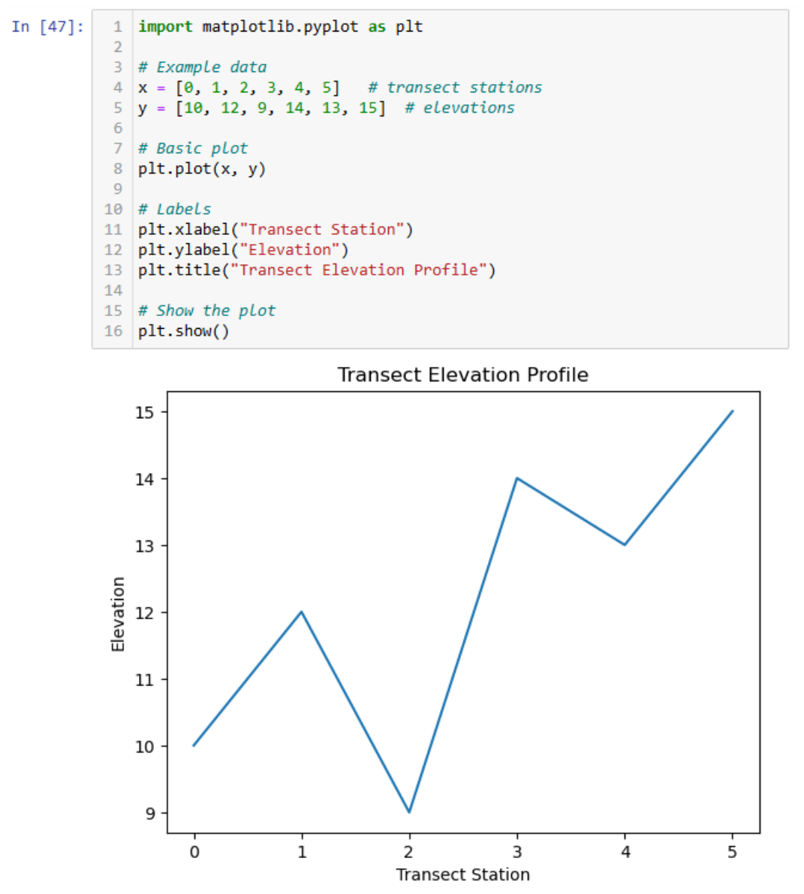

**Basic Jupyter Notebooks Commands:**

- Enter – Activate the current cell (switches to Edit Mode so you can type inside it)
- Esc – Deactivate the current cell (switches to Command Mode so you can use shortcuts)
- Ctrl+Enter – Run the current cell and keep focus on it
- Shift+Enter – Run the current cell and move to the next one
- A – Insert a new cell above the current cell
- B – Insert a new cell below the current cell
- DD – Delete the current cell
- Z – Undo cell deletion
- M – Change the current cell to Markdown
- Y – Change the current cell to Code
- H – Show the keyboard shortcut help dialog

## 4.1 Import Python Packages

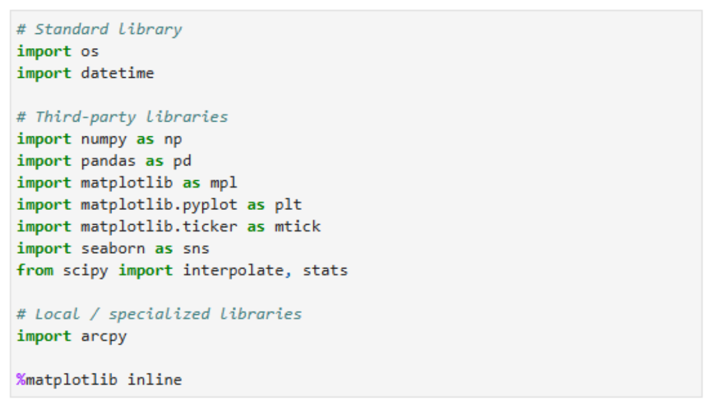

## 4.2 Import Custom Python Functions

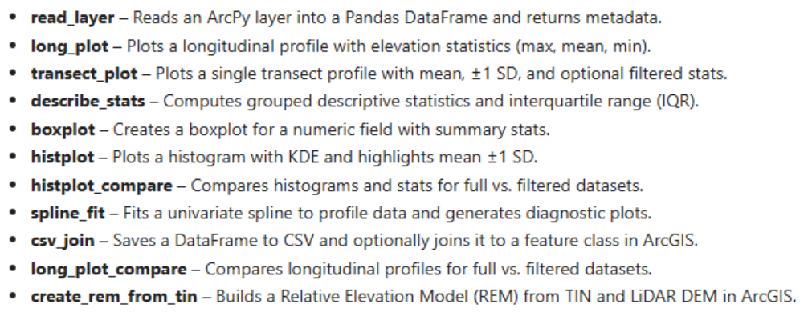

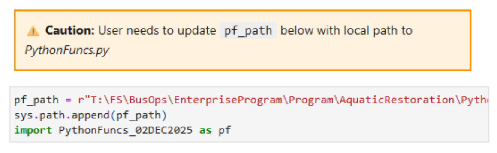

## 4.3 Import Transect Station Elevation Data

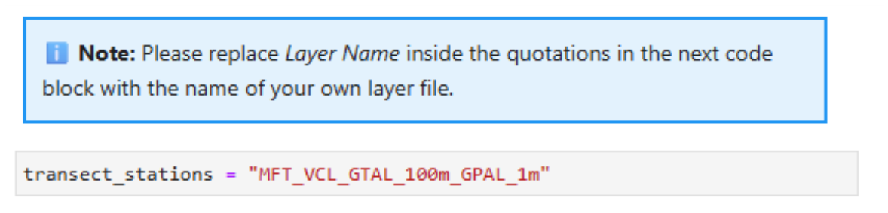

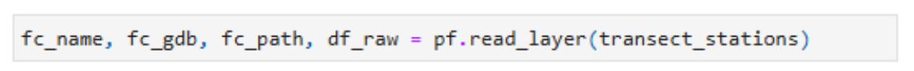

## 4.4 Inspect and Clean Data

### 4.4.1 Label parameters

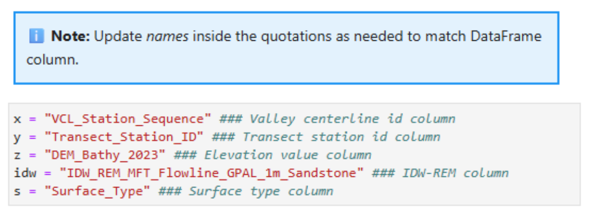

### 4.4.2 Create a clean Df with just the parameters of interest

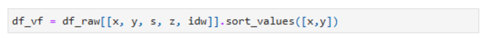

### 4.4.3 Create a filtered Df that only includes transect stations <= 8 meters

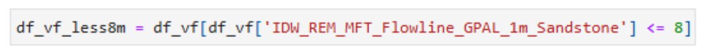

## 4.5 Plot Longitudinal and Transect Elevation Profile and Statistics

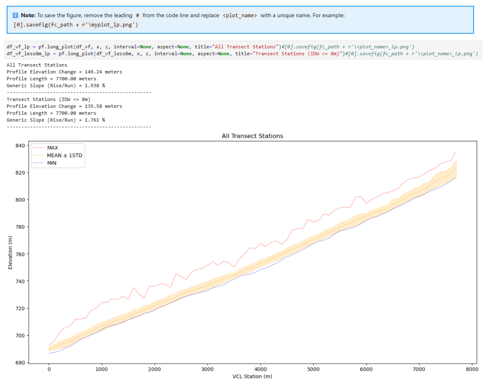

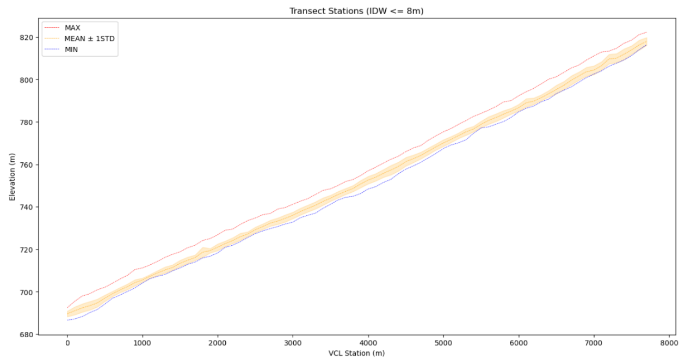

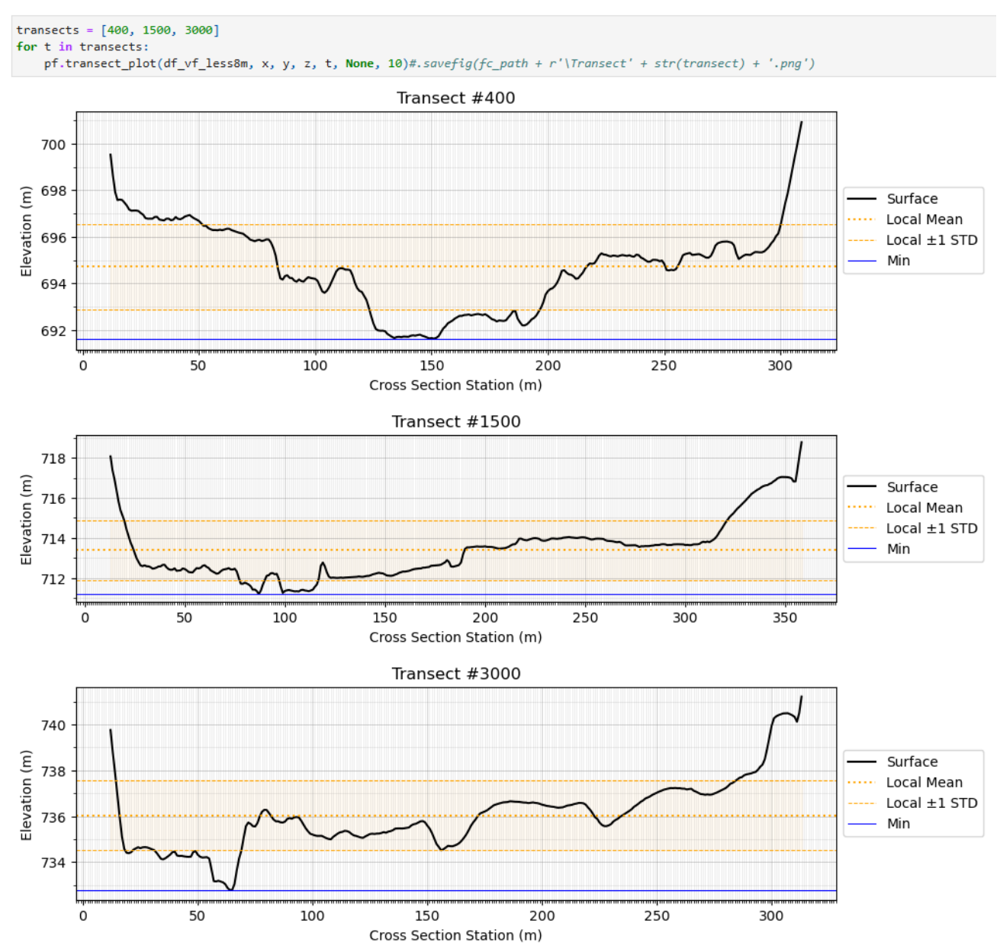

## 4.6 Gather Descriptive Statistics of Transect Elevation

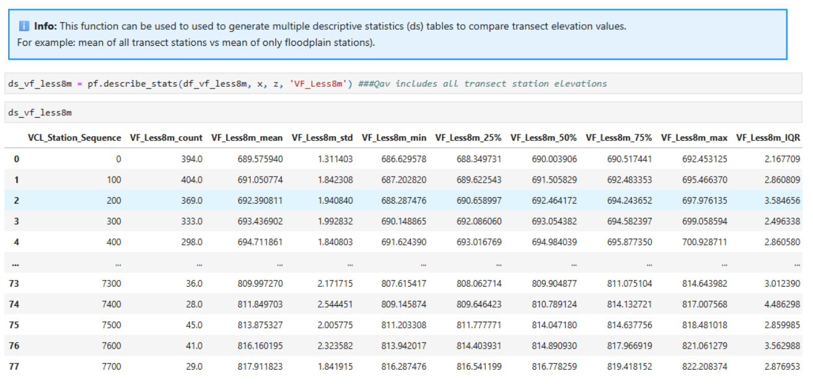

## 4.7 Fit Polynomial Spline to Transect Minimum Elevations

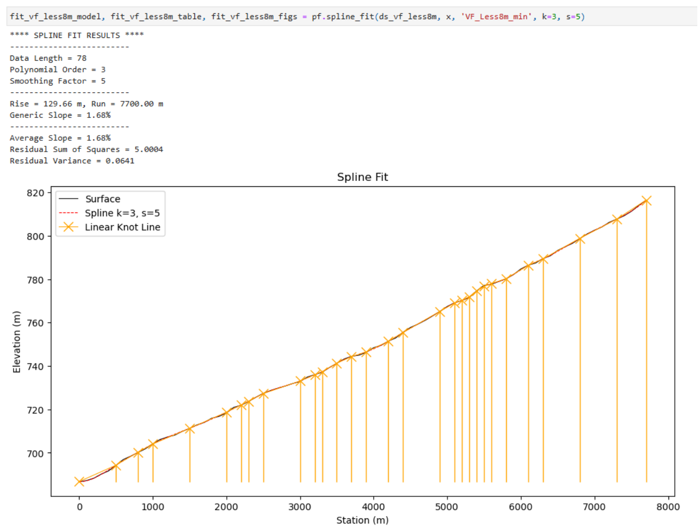

## 4.8 Export Model Fit Values CSV and Join to Transect Stations Feature Class

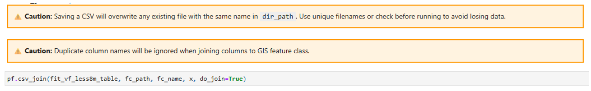

## 4.9 Generate Qvf-Min Relative Elevation Model

Objective : Build an REM from the Qvf_Min modeled spline fit values.

Purpose : A relative elevation model of the flowline (presumed water surface or bathymetric thalweg) helps evaluate the relatability of geomorphic surfaces in the current condition. Assuming that main channel is at least somewhat incised, we would expect a greater range of relative elevation values in more disconnected valleys, and in valleys with more geomorphic complexity (distinct geomorphic surfaces) .

!!! note
    Notes : Python functions are executed in Jupyter Notebook. These steps are exploratory and iterative in nature. Different sites will pose different problems and will require more or less analysis to confidently identify the GGL.

Data Needs:

- Transect Stations with modeled polynomial spline fit values.
