# 5 Explore and Classify Valley Floor Surface Types

Objective : Create a polygon feature class to identify and label various geomorphic surfaces (e.g. channel, floodplain, terrace, hillslope, fans, modified surfaces, etc.) and their origins within the Qvf perimeter and append values to transect stations.

Purpose : Isolate the most likely pre-Anthropocene surfaces and fit a polynomial spline to only those surfaces.

!!! note
    Notes:

## 5.1 Classify Surfaces TYPE/ORIGIN Based on Transect-Min Fit-REM Natural Breaks

Objective: Reclassify REM based on likely surface groupings and classify additional surface types with a polygon.

Purpose: Use distribution of relative elevation by surface type.

### 5.1.1 Natural Breaks (Jenks) Grouping

Use Jenks (Natural Breaks) symbology to sequentially investigate increasing number of breaks/surfaces. Additionally, estimate the number of geomorphic surfaces based on transect profiles (3d analyst).

Minimum number of plausible surfaces with bathymetric data:

I. Existing/Incised channel (low surfaces). There may be an additional inset floodplain surface, but it will likely initially group with the existing channel. II. Non-down-valley-surfaces (high surfaces). Alluvial fans, roads and constructed features, pastures, colluvial deposits, etc. These surfaces are best identified, labeled, and removed from the groups as their values will serve as noise and reduce the accuracy of the groups. Additionally, we can use natural breaks analysis to help classify these surfaces. III. All other down-valley geomorphic processes (may include multiple alluvial or glacial terraces)

We start with three breaks and investigate the distribution. We then guess, based on our understanding of the site, how additional groups will divide the current distribution prior to increasing the number of groups by 1. We repeat this step while using supporting information and transect profiles (3d analyst) to describe the likely number of distinct geomorphic surfaces and explain their likely origin. In the MF Teanaway River example, we relied upon Schanz et al 2019, and their carbon dating and field works to differentiate seven steps within the valley of interest. In the screenshots below, we start with three breaks and explore the valley. We continue adding breaks, four, five, six and eventually seven. We then overlayed the breaks documented by Schanz et all and compared our results.

#### 5.1.1.1 Three Breaks

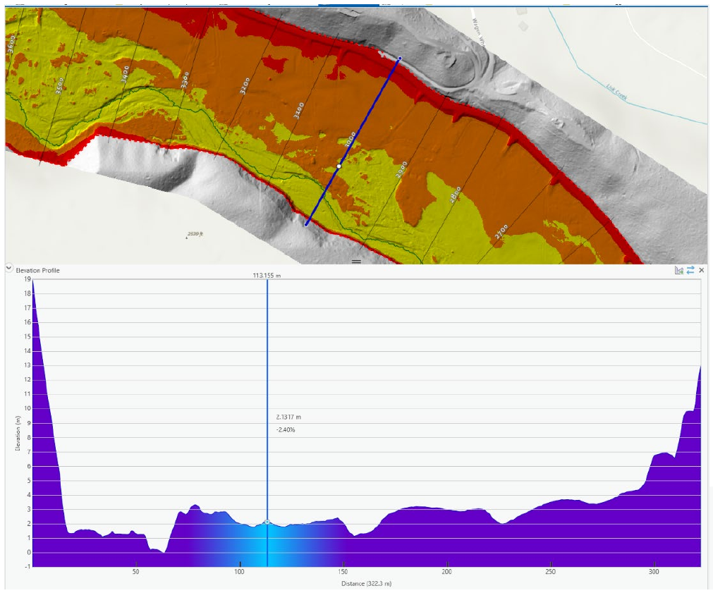

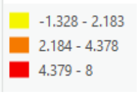

#### 5.1.1.2 Four Breaks

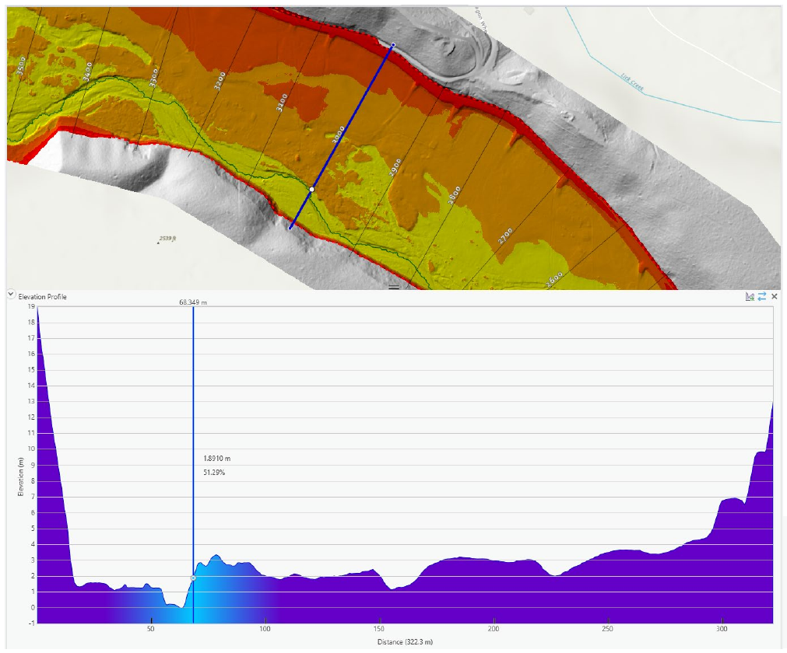

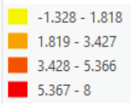

#### 5.1.1.3 Five Breaks

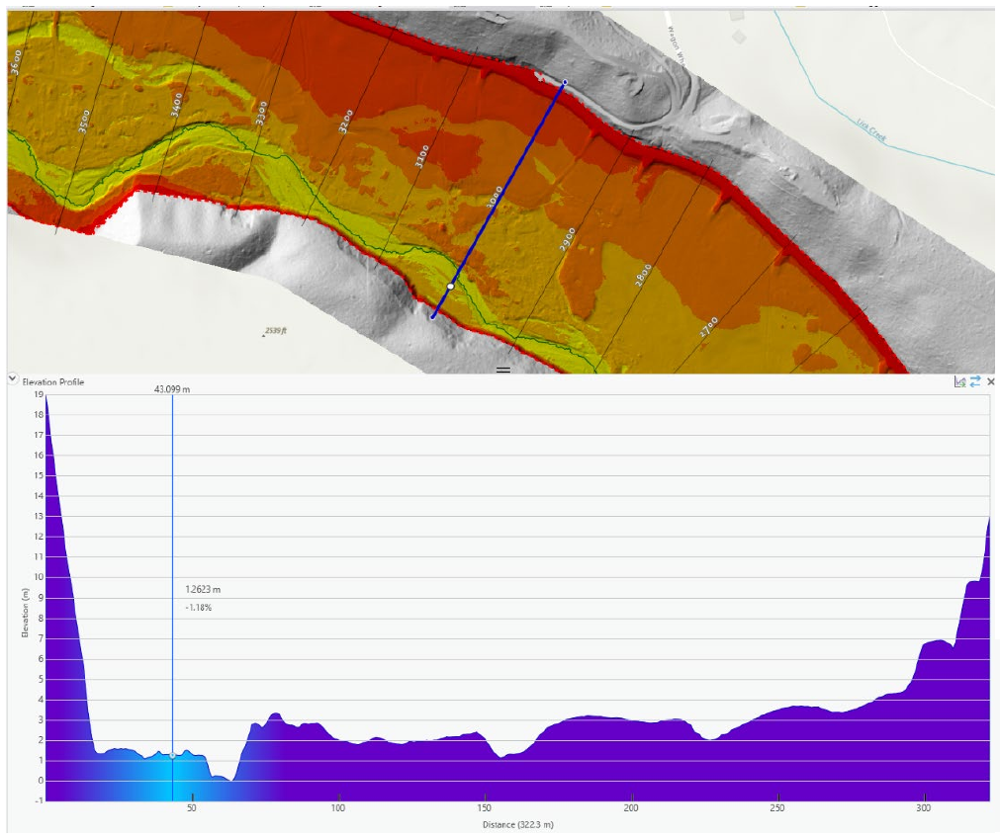

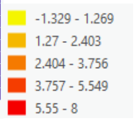

#### 5.1.1.4 Six Breaks

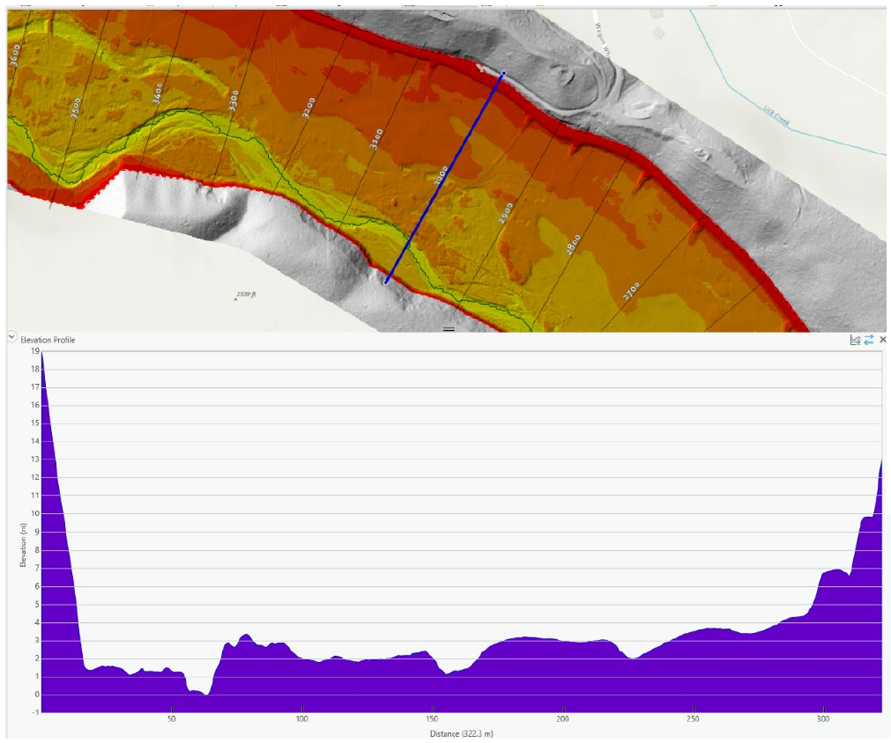

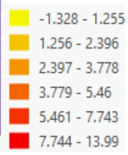

#### 5.1.1.5 Seven Breaks

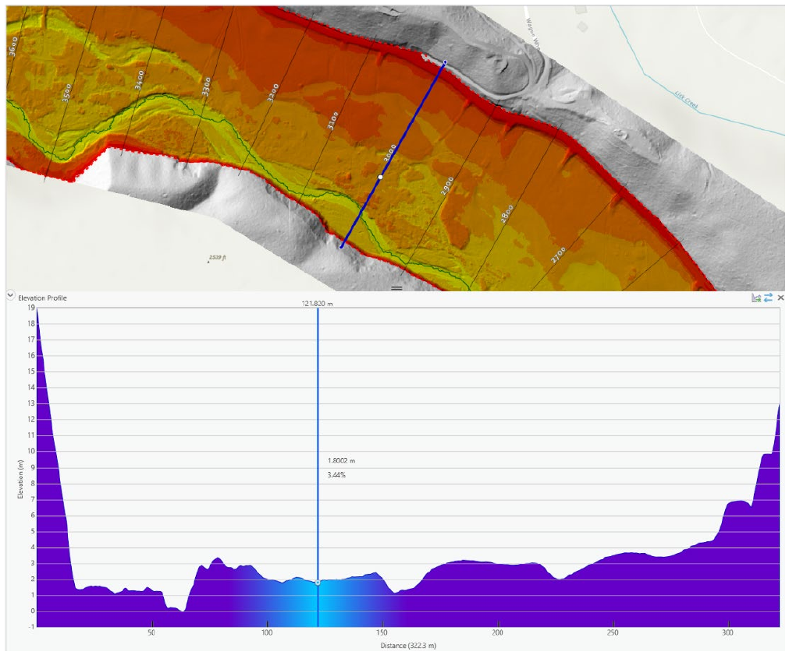

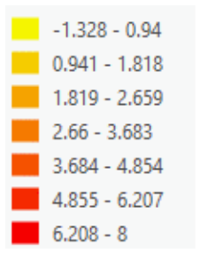

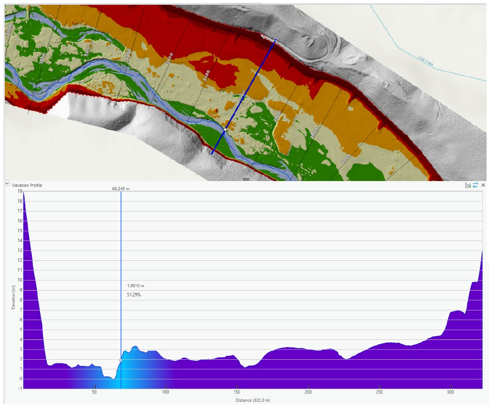

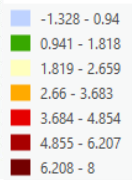

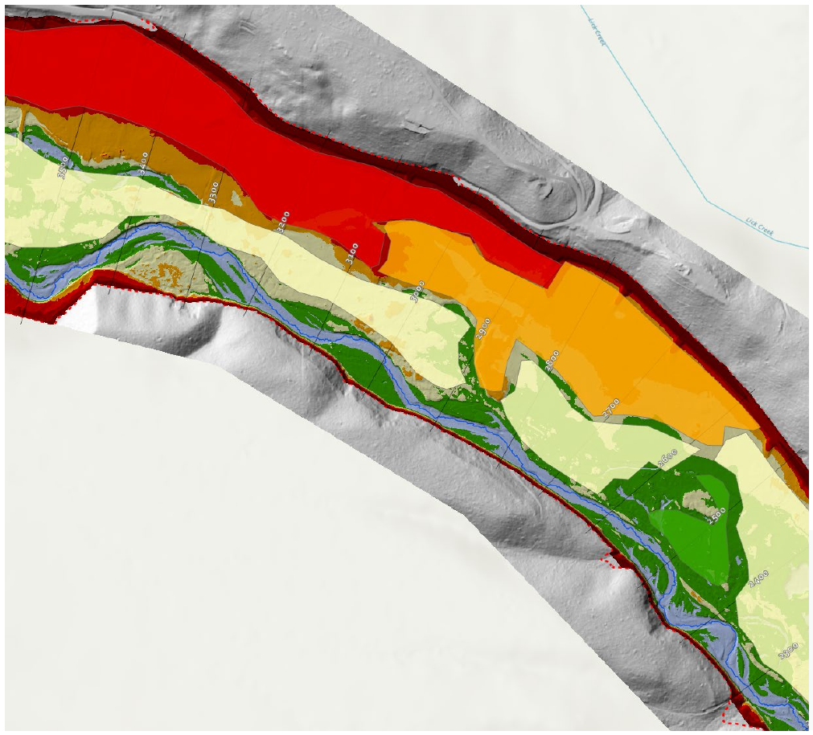

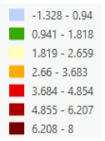

### 5.1.2 Reclassify Breaks

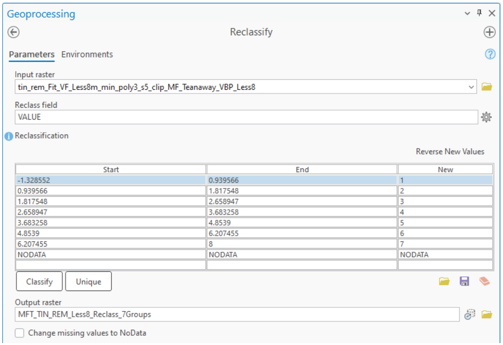

### 5.1.3 Raster to Polygon

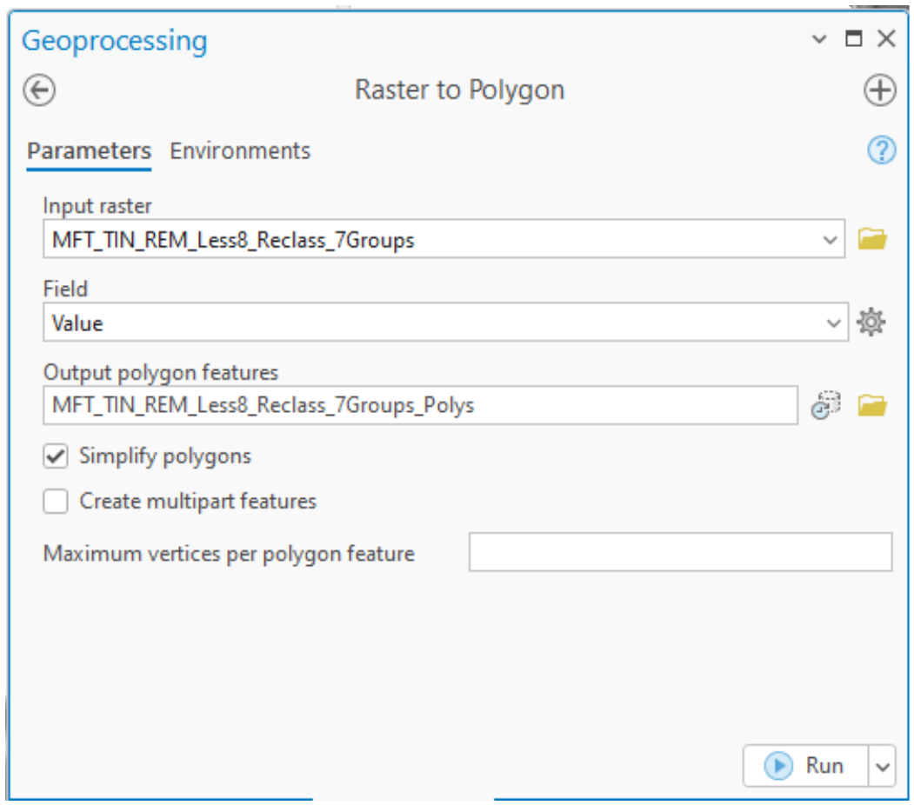

### 5.1.4 Add “Surface_Type” field and label breaks.

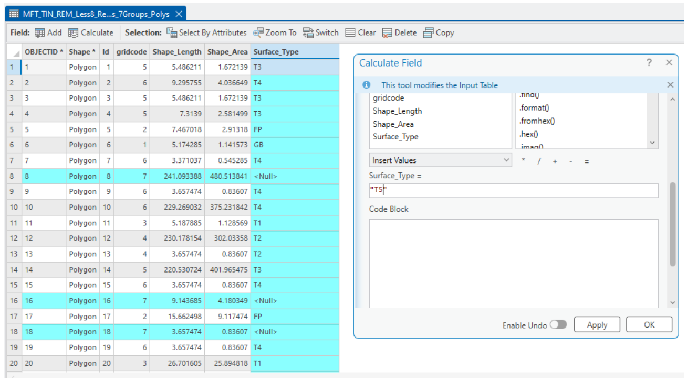

### 5.1.5 Spatially Join Surface Types to Transect Stations

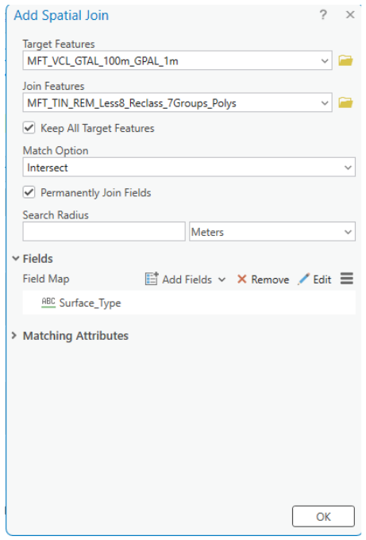

### 5.1.6 Plot and Inspect Line Chart and Box Plot

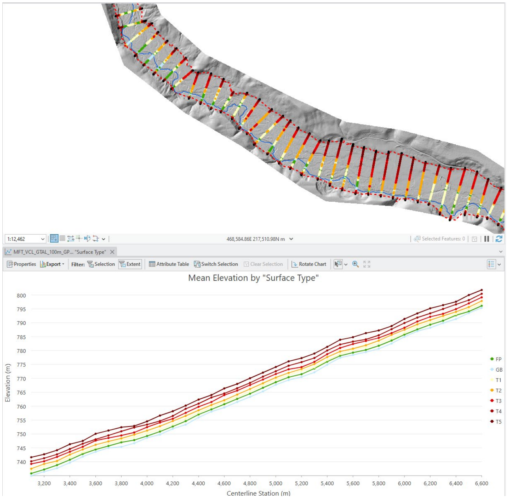

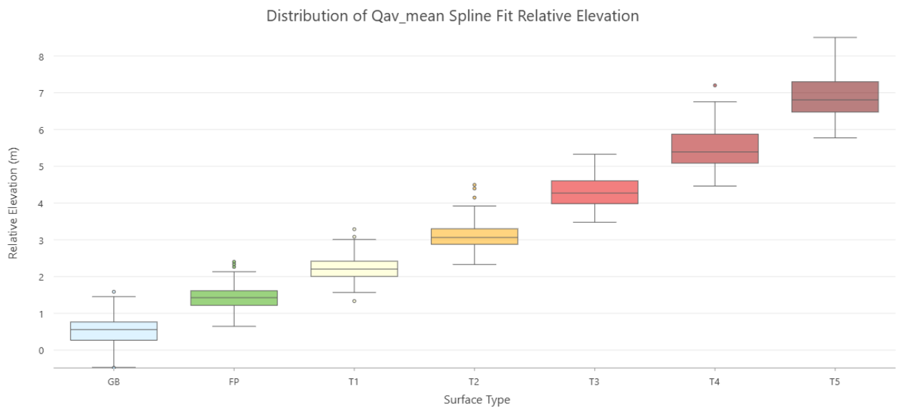

### 5.1.7 Draw and classify/reclassify additional surfaces

This can be started prior to natural breaks grouping, but more likely is a continue process as we develop a deeper understanding of the valley.
