# 7 Build GGL Surface

## 7.1 Conditional GGL Filling

### 7.1.1 Fill to Zero

Use Raster Calculator and Con function to create a new raster where cells with relative elevation values less than or equal to zero are replaced with GGL-Raster values, and all other cells remain as LiDAR DEM.

Con(GGL_REM <=0, GGL_Raster, DEM)

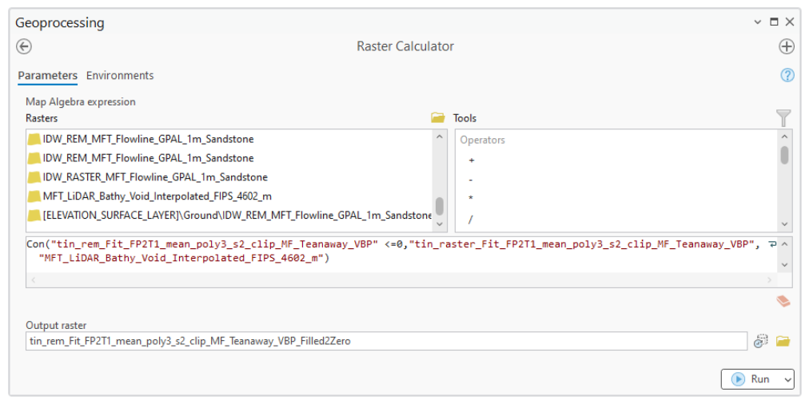

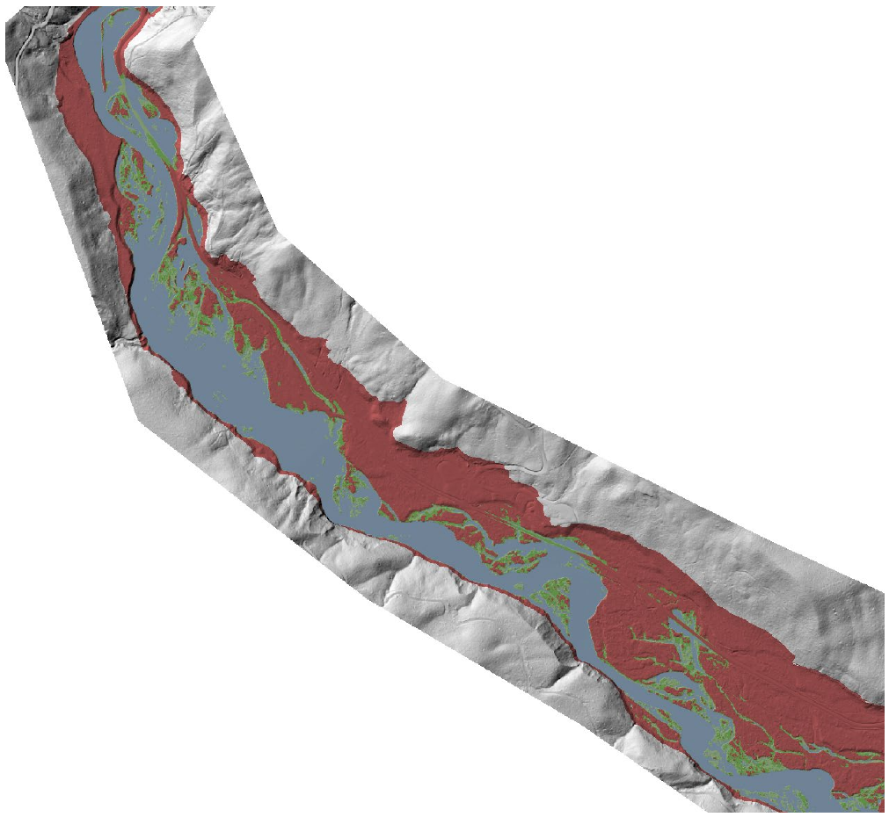

### 7.1.2 Fill to -1STD

Where REM is less than -0.45m, fill to zero, else DEM

Con( (REM < x) & (REM

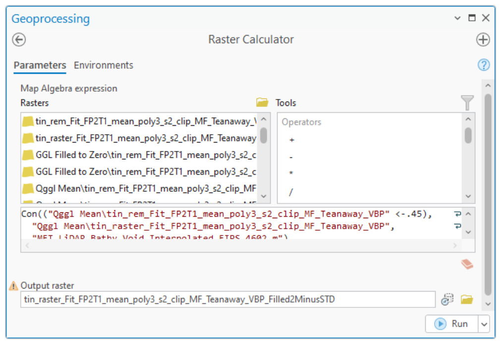

## 7.2 Reclassify GGL-REM by Surface Types

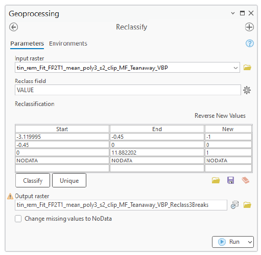

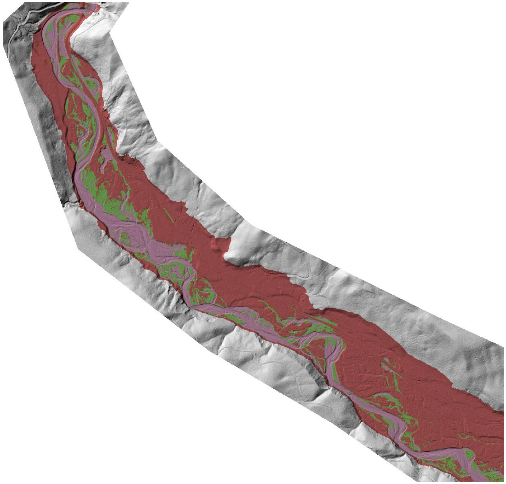

## 7.3 Design Surface Polygons

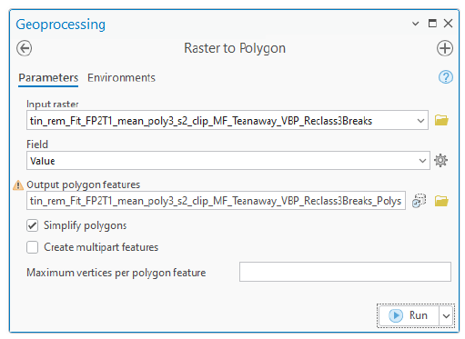

### 7.3.1 Add Fields

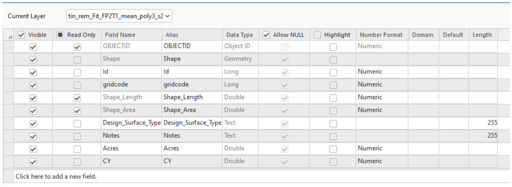

Update “Design_Surface_Type”

- -1 = “Potential Fill”
- 0 = “Target”
- +1 = “Potential Cut”

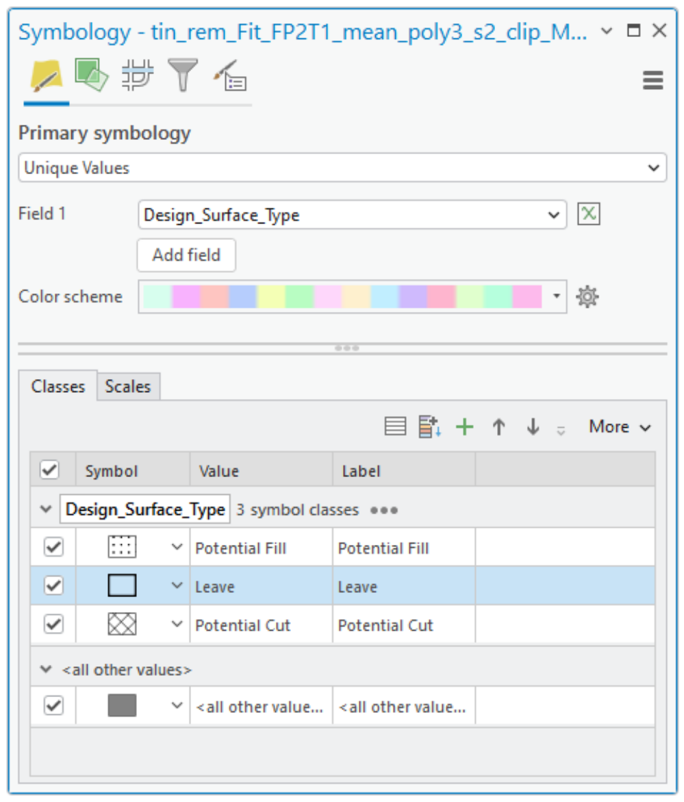

Update Design Surface Types from Filled2MinusSTD REM

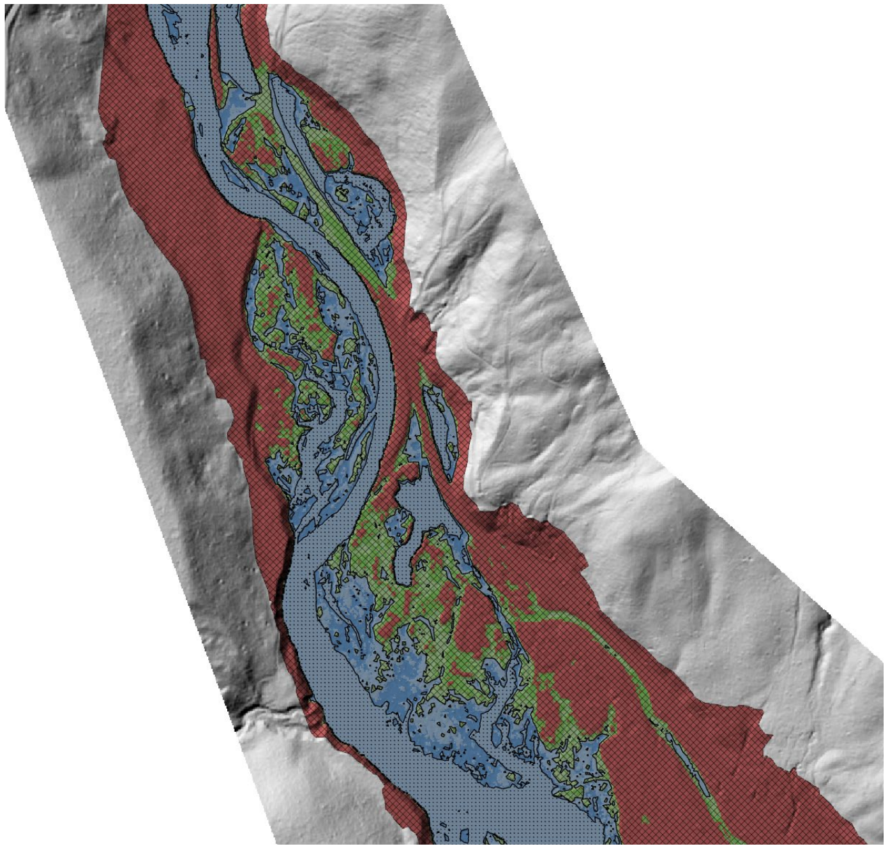

## 7.4 Volume Calculations

### 7.4.1 Zonal Statistics as a Table

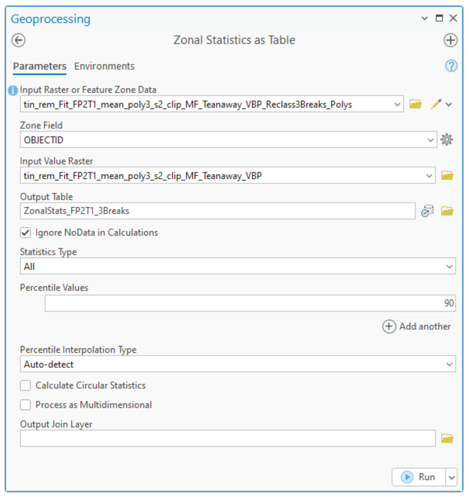

### 7.4.2 Join Table to Feature

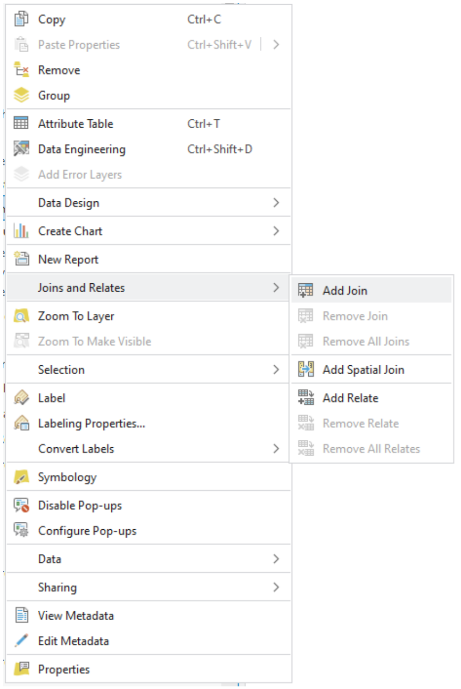

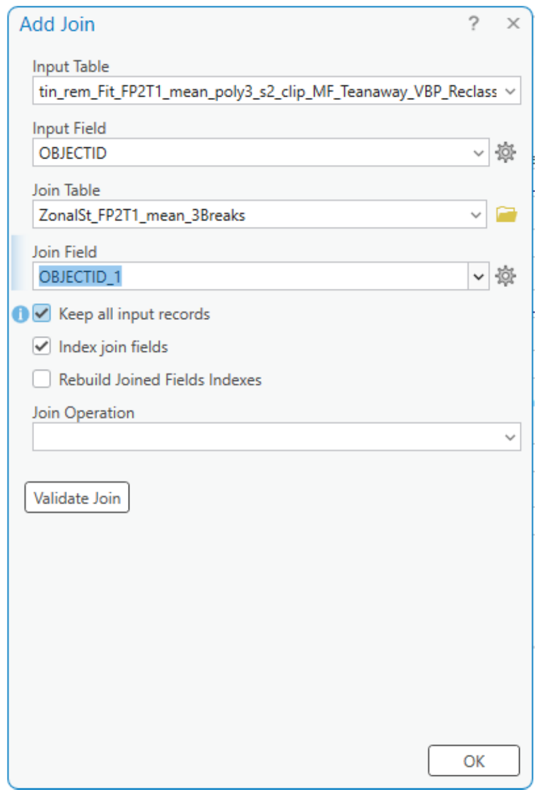

### 7.4.3 Calculate Field for “Cy”

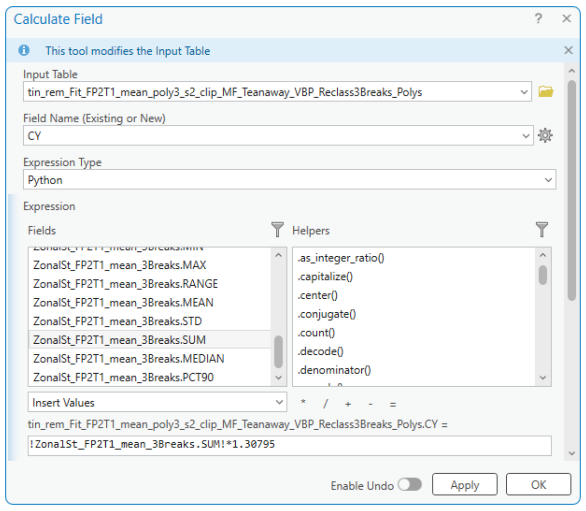

### 7.4.4 Calculate Geometry for “Acres”

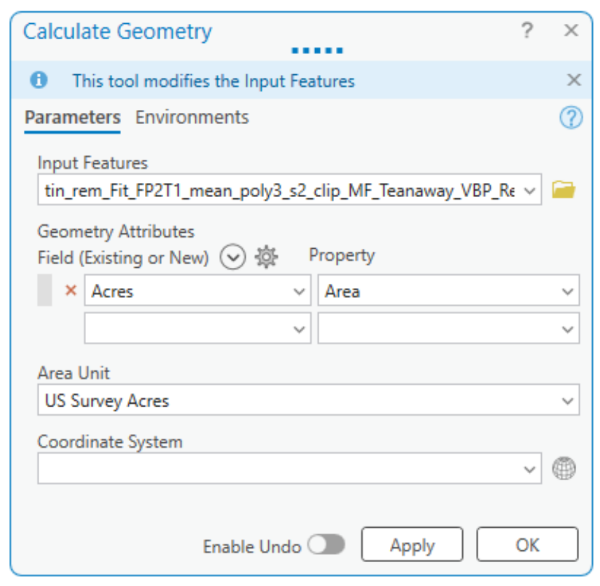

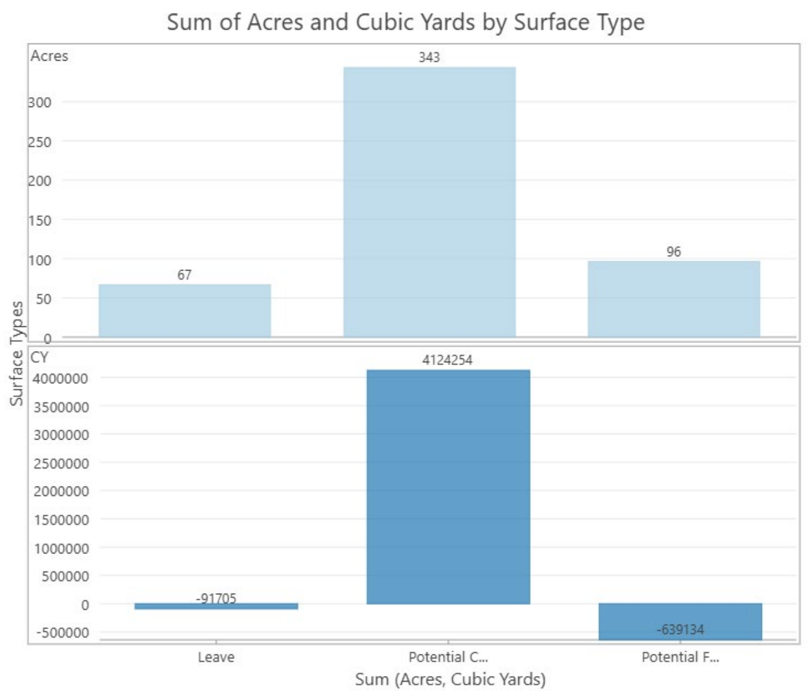
